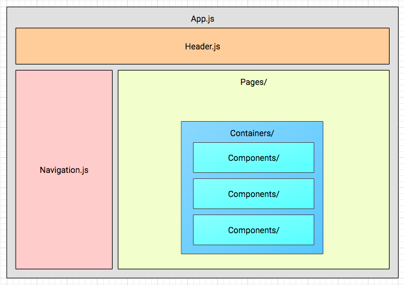
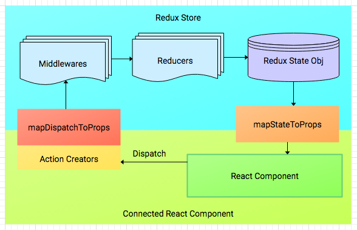

# Architecture

## Built With
The project is built with [create-react-app](https://github.com/facebookincubator/create-react-app). `react-scripts` is a bundled script that contains webpack, webpack-dev-server, babel (jsx, es2015, object spread), eslint, polyfills, jest, and autoprefixer.

Application state is managed using [Redux](https://github.com/reactjs/redux).

Styling is based in **SmartAdmin-Google Material** theme with some modifications found in `src/styles/css/styles.css`. Check [styling docs](./styling.md) for more info.

## Libraries used
- [react and react-dom](https://github.com/facebook/react) => React Core Library
- [redux](https://github.com/reactjs/redux) and [react-redux](https://github.com/reactjs/react-redux) => Redux Library and Integration
- [redux-thunk](https://github.com/gaearon/redux-thunk) => Redux middleware for dispatching `function` as `action`
- [redux-form](https://github.com/erikras/redux-form) => Used for complex forms. Values are stored in the Redux store
- [redux-api-middleware](https://github.com/agraboso/redux-api-middleware) => Used for connecting to API server via `fetch`
- [normalizr](https://github.com/paularmstrong/normalizr/tree/460b18280641e959f2936e551d01a43af4eb5144) => v2. Normalizes object that the server returns
- [react-router](https://github.com/ReactTraining/react-router/tree/v3/docs) => v3. Main routing library
- [react-bootstrap](https://github.com/react-bootstrap/react-bootstrap) => React components that abstract Bootstrap elements
- [react-select](https://github.com/JedWatson/react-select) => Used for creating dynamic dropdowns and autocomplete
- [lodash](https://github.com/lodash/lodash) => Utility functions
- [reapop](https://github.com/LouisBarranqueiro/reapop) and [reapop-theme-wybo](https://github.com/LouisBarranqueiro/reapop-theme-wybo) => Used for notifications

## UI Structure



Check out [React Components](./react-components.md) for more info on this.

## React/Redux Overview



Check out [Managing App State](./managing-app-state.md) docs for more info on this.

## File Structure
```
 |- src/
 |  |- actions/                => Redux Action creators
 |  |- components/             => Reusable general purpose React components
 |  |- containers/             => React components that connects to Redux Store
 |  |- pages/                  => Main screen for every routes
 |  |- reducers/               => Redux Reducers
 |  |- store/                  => Redux Store definitions
 |  |- styles/                 => Contains images and css files
 |  |- constants.js            => Contains constant value definitions
 |  |- routes.js               => Contains URL route definitions that react-router uses
 |  |- schemas.js              => Contains schema for entities
 |  |- utils.js                => Utility functions used throughout the app
 |  |- index.js                => Main entry file
 |
 |- public/
 |  |- index.html              => HTML file template
 |  |- static/                 => Other static files
 |
 |- package.json               => Used by NPM scripts. Contains all libraries used in the app
```
